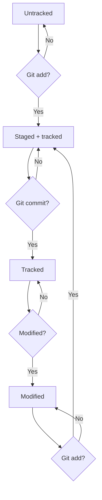

# Все что я узнала про Git
1. Создала новую папку test-repository локально и добавила туда через командную строку файл readme.md 
cd ~/dev/test-repository 
touch readme.md
2. Добавила этот файл в Git и закоммитила
Git add readme.md
Git commit -m 'Мой комментарий'
3. [Создала новый репозиторий test-repository на GitHub](https://github.com/VyatchaninaNadezhda?tab=repositories)
4. Так как SSH уже созданы и переданы в настройки на GitHub, сразу связала удаленный репозиторий с локальным
 cd ~/dev/test-repository
$ git remote add origin git@github.com:%ИМЯ_АККАУНТА%/first-project.git 
5. Добавила информацию в readme.md файл
6. Сохранила
7. Закоммитила изменения
8. Запушила изменения в readme.md файле на GitHub
Git push origin main
9. Проверила на GitHub отображение readme.md файла и его содержания

_________________________
# Информация о HEAD
- HEAD- файл в папке .git есть служебный файл HEAD. Он указывает на самый свежий коммит.
- Вместо хеша последнего коммита можно написать слово HEAD

```
$ cd ~/dev/first-project
$ cd .git/
$ ls 
COMMIT_EDITMSG  ORIG_HEAD  description  index  logs/     refs/
HEAD            config     hooks/       info/  objects/
$ cat HEAD 
ref: refs/heads/master # в файле вот такая ссылка 
$ cat refs/heads/master # взяли ссылку из файла HEAD
e007f5035f113f9abca78fe2149c593959da5eb7
```
________________________
# Информация о хешах
- Хеш - уникальный идентификатор коммита, состоящий из набора букв и цифр
- Хеш позволяет узнать автора, дату и содержимое закоммиченных файлов
- Все хеши, а также таблицу соответствий хеш → информация о коммите Git хранит в папке .git
- Хеш можно найти, используя команду ```git log``` или ```git log --oneline``` для сокращенного вида лога (Сокращённый хеш можно использовать точно так же, как и полный. Для этого команда git log --oneline автоматически подбирает такую длину сокращённых хешей, чтобы они были уникальными в пределах репозитория)

___________________
# Статусы файлов в Git


